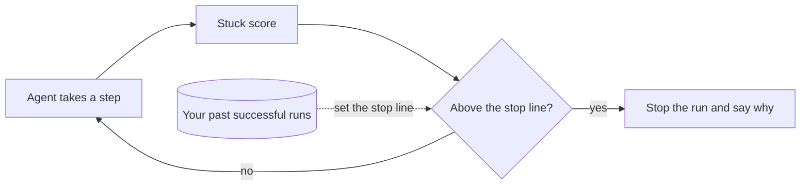

<div align="center">

# LoopBrake

**Brakes for stuck AI agents.**

Stop agent runs that are going in circles, with a guaranteed limit on how often a good run gets stopped.

[](#status)
[](pyproject.toml)
[](pyproject.toml)
[](LICENSE)

</div>

---

## The problem

AI agents get stuck. They run the same command again and again, re-read the same file, or hit the
same error, and they keep spending tokens until a step or budget limit finally stops them.

The usual fixes are blunt: a fixed step limit, or a rule like "stop after the same action 3 times".
Set them tight and you kill runs that would have succeeded. Set them loose and you pay for every loop.

## The idea

LoopBrake watches a run one step at a time and gives each step a **stuck score**. When the score
crosses a **stop line**, it stops the run and says why.

The stop line is not guessed. It is set from **your own past successful runs**, so that at most a
chosen share of good runs, for example 5 in 100, would ever cross it. That is a statistical
guarantee (split-conformal calibration), not a tuned target.



## What a stop looks like

A real run from the public SWE-bench data (GPT-5-mini), replayed through LoopBrake. The agent kept
searching the same files for a function and found nothing new:

```text
swe-gpt5mini · matplotlib__matplotlib-25775 · stopped at step 27 of 72 · saved 2,023,115 tokens (84%)
Reason: repeating in 5 of last 5 steps (similar to step 19); nothing new in 2 of last 5 steps (0 of 21 output lines new)

  23  sed -n '760,1080p' lib/matplotlib/backend_bases.py
  24  grep -n "def set_antialiased" -n lib/matplotlib/backend_bases.py || true
  25  sed -n '892,932p' lib/matplotlib/backend_bases.py
  26  sed -n '1,220p' lib/matplotlib/patches.py
  27  grep -n "set_antialiased" -n lib -R || true
```

More in [eval/results/kill-stories.md](eval/results/kill-stories.md).

## Phase 1 results

Before building the product, we tested the idea offline. We replayed **2,979 recorded runs** from
six agent groups, on coding tasks
([SWE-bench Verified](https://github.com/SWE-bench/experiments)) and customer-service tasks
([τ-bench](https://github.com/sierra-research/tau-bench)).

| Finding | Result |
|---|---|
| The guarantee held: good runs stopped by the chosen method, on every test group | **at most 4.9%** (limit 5%) |
| The naive rule "stop at 20 steps or 3 repeats" stops good runs | **99.3%** (Devstral), **29.1%** (GPT-5-mini) |
| Tokens saved by a calibrated step limit (GPT-5-mini, 100 past runs) | **11.2%** |
| Tokens saved by the stuck signals (same setting) | **12.9%** |
| Extra saving from stuck signals over the step limit, with 95% interval | SWE-bench **+1.5%** [−9.7%, +13.2%]<br>τ-bench **+0.9%** [−3.1%, +5.0%] |

**Verdict: NO-GO.** The cheap stuck signals do not clearly beat a calibrated step limit. Following
the plan set in advance, a second experiment tested a progress judge (below).
For comparison, [FailFast](https://arxiv.org/abs/2608.03222), a trained monitor, reports 14.6–20.4%
saved at 5% of good runs stopped. Its threshold was set on the same data it reports on, though, so
that 5% is a target, not a guarantee.

Full report: [eval/results/results.md](eval/results/results.md)

## Progress judge: also NO-GO

Counting repeats is not the same as understanding a step, so the second experiment asked a fast
hosted decision model, [Jev](https://docs.typesafe.ai) (`jev-1.13.0`), about every step: *did this
move the agent closer to finishing?* and *what kind of step was it?* Savings are counted **net**:
every token the judge reads is subtracted. The method was chosen on one agent and committed
(`0827ece`) before any other agent was judged.

| Dataset | Extra net saving over the step limit, with 95% interval |
|---|---|
| SWE-bench (GPT-5-mini) | **−6.3%** [−18.9%, +1.9%] |
| τ-bench (4 groups) | **−4.2%** [−8.2%, −1.5%] |

What we learned:

- **A threshold tuned on one agent did not travel.** The chosen method asked the judge only when the
  cheap score passed a level set on Devstral's long runs. On the other agents that level was almost
  never reached (0–0.3% of steps), so the method rarely stopped anything.
- **A judge on every step is expensive.** On short customer-service tasks it used about as many
  tokens as the agent itself.
- **Even ignoring its cost, the judge did not spot stuck runs better than counting steps**: for
  example 7.3% vs 9.3% of tokens saved on GPT-5-mini.
- The guarantee held on every group. The whole experiment took 73,812 judgments, for about $3.91.

Full report: [eval/results/judge/results.md](eval/results/judge/results.md)

## How the results are kept honest

- **Chosen in advance.** The method was picked using one agent's runs and committed *before* any
  test runs were scored (commits `8b8eaf3` and, for the judge, `0827ece`).
- **Mistakes stay visible.** The first results were committed exactly as they came out, including a
  flaw in how runs were split (`e655b96`). The fix is a separate, documented commit (`76e8cdc`), with
  before-and-after numbers in [CORRECTIONS.md](eval/results/CORRECTIONS.md).
- **Tested on unseen runs.** The stop line is always checked on runs it was not set from.
- **Reproducible.** Every number above comes from `eval/results/` and comes out identical on every run.

## How the guarantee works

1. Each step gets a stuck score. A run's score is the highest score it reaches.
2. Take *n* past successful runs and sort their scores. The stop line is the *k*-th smallest score,
   where *k* = ⌈(*n* + 1)(1 − α)⌉ and α is the share of good runs you accept losing (for example 5%).
3. A new successful run then crosses the stop line with probability at most α.

With α = 5%, LoopBrake needs at least 19 past successful runs. With fewer, it only watches and
never stops anything.

The guarantee holds when new runs look like the past ones (same agent, same kind of tasks), and when
the past runs come from different tasks. We learned the second condition the hard way: see
[CORRECTIONS.md](eval/results/CORRECTIONS.md).

## Reproduce

Requires [uv](https://docs.astral.sh/uv/) and Python 3.11+.

```bash
git clone https://github.com/SahilSelokar/LoopBrake && cd LoopBrake
uv run pytest                        # 61 tests
uv run python eval/fetch.py          # one-time download, about 450 MB, into ~/.loopbrake/data
uv run python eval/run.py --final    # about 1 minute; writes eval/results/
```

The progress judge needs a [Typesafe](https://typesafe.ai) API key in `TYPESAFE_API_KEY` (or in
`~/.loopbrake/typesafe_key`). Judging every public step costs about $4:

```bash
uv run python eval/tasks.py                              # task texts for the judge
uv run python eval/judge.py --group swe-devstral         # one group at a time; resumable
uv run python eval/judge_eval.py --final                 # reads stored answers only; writes eval/results/judge/
```

## Repository layout

```text
src/loopbrake/   scoring core: stuck signals, stop-line rule, run readers (standard library only)
eval/            the experiments: fetch.py downloads the data, run.py replays runs, judge.py asks the
                 progress judge, judge_eval.py scores its answers; results/ holds the published numbers
specs/           design: constitution, roadmap, and the spec, plan, research and tasks of each experiment
tests/           tests, including a check of the guarantee on simulated data
liveness.py      the original naive rule, kept as the baseline
```

## Roadmap

| Phase | What | Status |
|---|---|---|
| 1 | **Experiment**: does it work on real runs? | Done: NO-GO for cheap signals |
| 1b | **Progress judge**: a hosted decision model judges whether each step moved the run forward | Done: NO-GO |
| 2 | **Python package**: `pip install loopbrake`, a few lines to add to any agent | Waits for a decision on what to ship |
| 3 | **Claude Code plugin**: stop stuck sessions live, calibrated on your own history | Planned |
| 4 | **Observability**: live dashboard, plus export to Datadog, Grafana and others via OpenTelemetry | Planned |
| 5 | **Launch**: a demo agent, the public release and a video | Planned |

The full plan is in [specs/roadmap.md](specs/roadmap.md).

## Status

Research phase. There is nothing to install yet. The package arrives in Phase 2, once an
evaluation says GO.

## License

[MIT](LICENSE). One test fixture is a trimmed τ-bench run, used under τ-bench's own MIT license
(see [tests/fixtures/NOTICE.md](tests/fixtures/NOTICE.md)).
